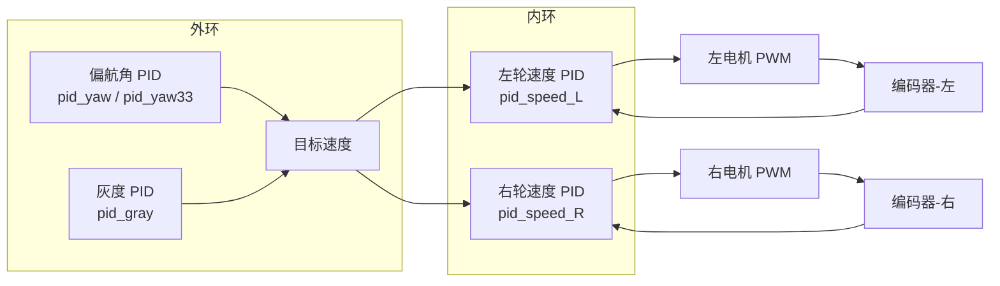

# 智能小车控制系统 — 代码架构文档

## 1. 项目概览

| 项目 | 说明 |
|------|------|
| 平台 | MSPM0G3507（Cortex-M0+） |
| 传感器 | JY61P 陀螺仪、8 通道灰度传感器、编码器 |
| 执行器 | TB6612 双路电机驱动、有刷直流电机 ×2 |
| 显示 | 128×64 OLED（SSD1306） |
| 控制算法 | PID（偏航角 / 灰度巡线 / 速度环） |
| 编译工具 | Keil MDK / EIDE + ARMCC |

---

## 2. 目录结构

```
basic_car/
├── user/                          # 用户层（主入口）
│   ├── empty.c                    # main() 主循环
│   ├── empty.syscfg               # TI SysConfig 工程文件
│   ├── ti_msp_dl_config.c/h       # 自动生成的驱动配置
│   └── device_linker.lds          # 链接脚本
│
├── app/                           # 应用层
│   ├── start/
│   │   ├── start.h                # 全局变量 extern 声明 + 函数声明
│   │   └── start.c                # init() / Collect_Data() / motion_control() / target_start() + 中断服务
│   ├── menu/
│   │   ├── menu.h                 # PageId 枚举 + MenuPage 结构体 + API 声明
│   │   └── menu.c                 # 3 页面 draw/onKey + 注册表 + menu_render/handle_keys/switchTo
│   ├── pid/
│   │   ├── pid.h                  # PID_TypeDef 结构体
│   │   └── pid.c                  # PID_Init / PID_Compute / PID_SetTarget
│   ├── filter/                    # 滤波器（均值/卡尔曼等）
│   └── uart/                      # 串口调试输出
│
├── bsp/                           # 板级驱动层
│   ├── borad/                     # LED、蜂鸣器、按键
│   ├── encoder/                   # 编码器（GPIO 脉冲计数 + 10ms 定时器测速）
│   ├── gray/                      # 8 通道灰度传感器（ADC + 偏差计算）
│   ├── JY61P/                     # JY61P 陀螺仪（UART 解析）
│   ├── OLED/                      # SSD1306 OLED 驱动
│   ├── tb6612/                    # TB6612 双路电机驱动（GPIO + PWM）
│   └── zdt_motor/                 # 电机运动命令封装
│
├── keil/                          # Keil 工程文件
├── eide/                          # EIDE 工程文件
├── gcc/                           # GCC 启动文件 + 链接脚本
└── tools/                         # 辅助工具脚本
```

---

## 3. 分层架构

```mermaid
graph TB
    subgraph "用户层 (user/)"
        MAIN[empty.c - main()]
    end

    subgraph "应用层 (app/)"
        START[start.c - 系统初始化 / 数据采集 / 运动调度]
        MENU[menu.c - 多页面菜单系统]
        PID[pid.c - PID 控制算法]
    end

    subgraph "板级驱动层 (bsp/)"
        ENC[encoder - 编码器测速]
        GRAY[gray - 灰度传感器]
        IMU[JY61P - 陀螺仪]
        OLED[OLED - 显示屏]
        MOTOR[tb6612 + zdt_motor - 电机驱动]
        BOARD[borad - LED / 蜂鸣器 / 按键]
    end

    subgraph "硬件抽象层 (Driver_Library/)"
        DRV[TI MSPM0 DriverLib + CMSIS]
    end

    MAIN --> START
    MAIN --> MENU
    START --> PID
    START --> ENC & GRAY & IMU & MOTOR
    MENU --> OLED & BOARD
    PID --> MOTOR
```

---

## 4. 主循环逻辑

```mermaid
flowchart TD
    RST[上电复位] --> INIT[init() 系统初始化]
    INIT --> LOOP{主循环 while(1)}

    LOOP -->|menu_start == 0| MENU_MODE[菜单模式]
    LOOP -->|menu_start == 1| RUN_MODE[运行模式]

    MENU_MODE --> RENDER1[menu_render: 绘制主菜单<br/>4 个 target + 光标箭头]
    RENDER1 --> KEYS1[menu_handle_keys:<br/>按键2=光标下移<br/>按键3=确认 → 进入运行模式]

    RUN_MODE --> COLLECT[Collect_Data:<br/>采集灰度 + 偏航角]
    COLLECT --> RENDER2[menu_render:<br/>绘制传感器页 / 电机转速页]
    RENDER2 --> KEYS2[menu_handle_keys:<br/>按键4=页面切换]
    KEYS2 --> TARGET[target_start:<br/>根据 menu_cursor 选择运动策略]
    TARGET --> UPDAT[oled_updat: 刷新 OLED]

    KEYS1 --> UPDAT
    UPDAT --> LOOP
```

---

## 5. 菜单系统（枚举 + 结构体注册表模式）

### 5.1 核心思想

所有页面信息集中在一个 **const 注册表** 中，运行时只需维护 3 个变量。

### 5.2 PageId 枚举

```c
typedef enum {
    PAGE_MAIN   = 0,  // 主菜单（target 选择）
    PAGE_SENSOR = 1,  // 传感器数据（偏航角 / 灰度）
    PAGE_MOTOR  = 2,  // 电机转速
    PAGE_COUNT        // 页面总数（自动计算）
} PageId;
```

### 5.3 MenuPage 结构体

| 字段 | 类型 | 说明 |
|------|------|------|
| `id` | `PageId` | 页面唯一标识 |
| `name` | `const char*` | 页面名称 |
| `maxItems` | `uint8_t` | 光标项数（0 = 无光标） |
| `draw` | `void(*)(uint8_t cursor)` | 绘制函数 |
| `onEnter` | `void(*)(void)` | 进入回调（可 NULL） |
| `onKey` | `void(*)(uint8_t key)` | 按键回调（可 NULL） |

### 5.4 页面注册表

```c
static const MenuPage menuPages[PAGE_COUNT] = {
    [PAGE_MAIN]   = { PAGE_MAIN,   "Main",   4, drawMain,   NULL, onKeyMain   },
    [PAGE_SENSOR] = { PAGE_SENSOR, "Sensor", 0, drawSensor, NULL, onKeySensor },
    [PAGE_MOTOR]  = { PAGE_MOTOR,  "Motor",  0, drawMotor,  NULL, onKeyMotor  },
};
```

### 5.5 按键映射

| 页面 | 按键 | 行为 |
|------|------|------|
| **PAGE_MAIN** | 按键2 | 光标下移（0→1→2→3→0 循环） |
| | 按键3 | 确认 → `menu_start=1` → 切换到 PAGE_SENSOR |
| **PAGE_SENSOR** | 按键4 | 切换到 PAGE_MOTOR |
| **PAGE_MOTOR** | 按键4 | 切换回 PAGE_SENSOR |

### 5.6 扩展新页面

只需 3 步，无需修改任何调度逻辑：

1. 在 `PageId` 枚举中 `PAGE_COUNT` 前新增 `PAGE_XXX`
2. 编写 `static void drawXxx(uint8_t cursor)` + 可选的 `onKeyXxx` / `onEnterXxx`
3. 在 `menuPages[]` 数组中添加一行注册

---

## 6. 运动控制架构

### 6.1 PID 控制层级



### 6.2 速度环详解

- **编码器脉冲累加**：GPIO 中断实时计数
- **10ms 定时清零**：`encoder_INST_IRQHandler()` 每 10ms 读取脉冲并清零 → `encoder_left_speed` / `encoder_right_speed`（单位：脉冲/10ms）
- **速度 PID**：`PID_Compute(&pid_speed_L/R, encoder_speed)` → 输出 PWM 值
- **电机输出**：`motor_set(out_R, out_L, 1)` → TB6612 GPIO 方向 + Timer PWM

### 6.3 目标调度（target_start）

根据 `menu_cursor`（用户在菜单中选中的 target）选择策略：

| `menu_cursor` | 策略 | 说明 |
|:---:|---|---|
| 0 | 偏航角循迹 | `pid_yaw.output ± 70` 差速控制 |
| 1 | 多阶段循迹 | a→循迹 → b→停车 → c→灰度循迹 → d→直行 |
| 2 | 33°偏航 + 多阶段 | a→偏航 → b→停 → c→灰度 → d→停 → e→回正 → f→停 → g→灰度 → h→停 |
| 3 | 预留 | — |

### 6.4 差速控制

```c
void motion_control(speed_right, speed_left, enable) {
    motor_set(speed_left, speed_right, enable);  // 左右对调
}
```

左右电机对向安装，`motor_set` 中左右参数交换后内部统一处理。

---

## 7. 传感器数据采集（Collect_Data）

```c
void Collect_Data(void) {
    measure_gray = Get_Analog_value(gray, black);  // 8 通道 ADC → 偏差值
    measure_yaw  = imu->angle_yaw;                  // JY61P 偏航角
    // 角度归一化：±90° 范围
}
```

- `gray[8]`：8 通道原始 ADC 值（由 `start.h` 声明为 extern）
- `black[8]`：校准基准值（硬编码，后续可改为 EEPROM 存储）
- `measure_gray`：灰度偏差（= 左右通道差值），输入 `pid_gray`
- `measure_yaw`：偏航角，输入 `pid_yaw` / `pid_yaw33`

---

## 8. 初始化流程（init）

```
SYSCFG_DL_init()                    ← SysConfig 自动生成（GPIO/时钟/Timer）
OLED_Init()                         ← SSD1306 I2C 初始化
jy61p_init()                        ← JY61P UART 初始化

启用定时器 1（OLED 刷新中断）
启用定时器 encoder（编码器 10ms 测速中断）

OLED 显示 "wait for init..."
jy61p_reset_angle()                 ← IMU 角度归零
OLED_Clear()

PID_SetTarget: gray→0, yaw→0, yaw33→-42
PID_Init: 速度环 pid_speed_L/R
```

---

## 9. 关键全局变量速查

| 变量 | 模块 | 类型 | 说明 |
|------|------|------|------|
| `menu_start` | menu | `uint8_t` | 0=菜单模式 / 1=运行模式 |
| `menu_currentPage` | menu | `PageId` | 当前活跃页面 |
| `menu_cursor` | menu | `uint8_t` | 主菜单光标 / target 选择（0~3） |
| `refresh` | menu | `uint8_t` | OLED 刷新标志（定时器中断置1） |
| `measure_yaw` | start | `float_t` | 偏航角测量值 |
| `measure_gray` | start | `int` | 灰度偏差测量值 |
| `gray[8]` | start | `uint16_t` | 灰度传感器 8 通道原始值 |
| `encoder_left_speed` | encoder | `volatile int32_t` | 左轮转速（脉冲/10ms） |
| `encoder_right_speed` | encoder | `volatile int32_t` | 右轮转速（脉冲/10ms） |
| `move` | start | `uint8_t` | 运动使能：1=运动 / 0=停止 |
| `st1` | start | `char` | 阶段状态机（'a'~'h'） |
| `pid_gray/yaw/yaw33` | start | `PID_TypeDef` | 外环 PID 控制器 |
| `pid_speed_L/R` | start | `PID_TypeDef` | 内环速度 PID 控制器 |

---

## 10. 中断服务汇总

| 中断 | 周期 | 功能 |
|------|------|------|
| `OLED_refresh_INST_IRQHandler` | ~20ms | 置 `refresh=1`，主循环中刷新 OLED |
| `encoder_INST_IRQHandler` | 10ms | 读取+清零编码器脉冲 → 速度 PID 计算 → PWM 输出 |
| GPIO 中断（编码器） | 脉冲边沿 | `encoder_left/right_count++` |

---

## 11. 按键定义（borad）

| 按键编号 | 菜单模式 | 运行模式 |
|:---:|---|---|
| 按键2 | 光标下移选择 target | — |
| 按键3 | 确认，进入运行模式 | — |
| 按键4 | — | 切换显示页面（传感器 ↔ 电机转速） |
